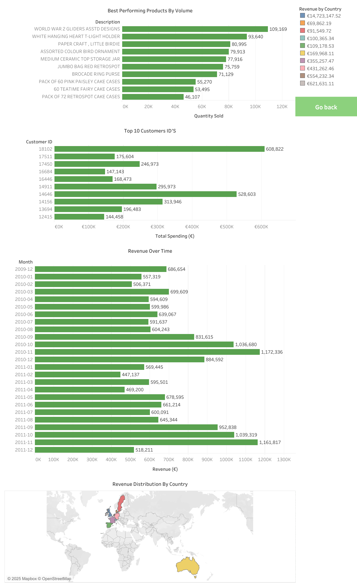
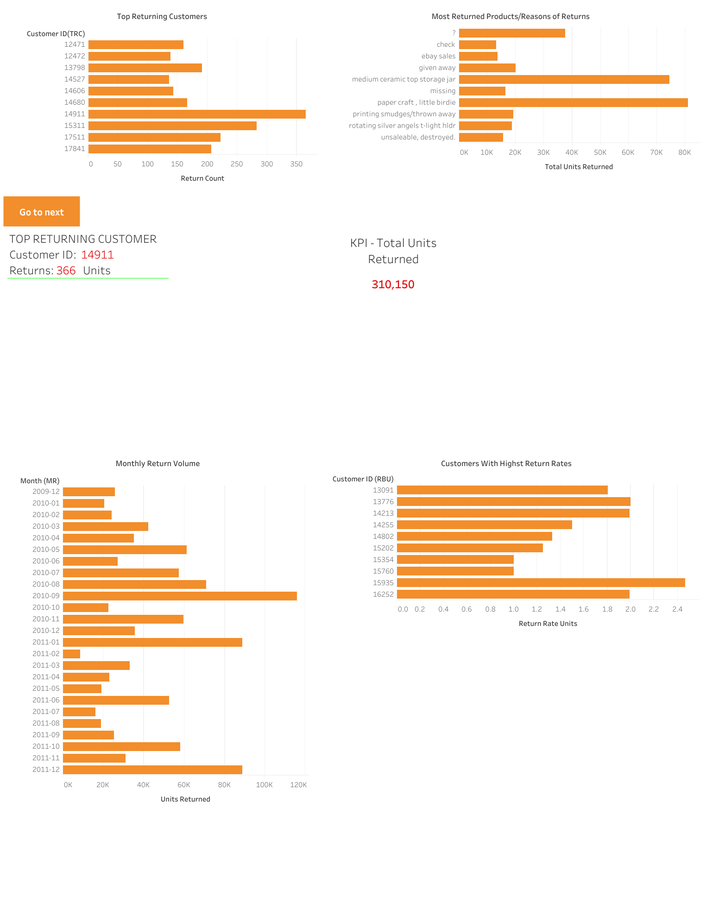

# 🛍️ EDA-onlineretail

> **Exploratory Data Analysis (EDA)** of the Online Retail II Dataset (2009–2011) using Python, Excel, and Tableau.

---

## 📚 Project Overview

An end-to-end Exploratory Data Analysis (EDA) project performed on the [UCI Online Retail II dataset](https://archive.ics.uci.edu/ml/datasets/Online+Retail+II).

The project focuses on:
- Revenue trends over time
- Top-performing products and customers
- Return behavior patterns
- Country-wise revenue contributions

---

## 🛠️ Tools and Technologies

- **Python** (Pandas, Matplotlib, Seaborn, NumPy)
- **Excel** (data cleaning and export for Tableau)
- **Tableau Public** (interactive dashboard creation)
- **Jupyter Notebook** (data exploration and analysis)

---

# 🛍️ EDA-onlineretail

> **Exploratory Data Analysis (EDA)** of the Online Retail II Dataset (2009–2011) using Python, Excel, and Tableau.

---

## 📚 Project Overview

An end-to-end Exploratory Data Analysis (EDA) project performed on the [UCI Online Retail II dataset](https://archive.ics.uci.edu/ml/datasets/Online+Retail+II).

The project focuses on:
- Revenue trends over time
- Top-performing products and customers
- Return behavior patterns
- Country-wise revenue contributions

---

## 🛠️ Tools and Technologies

- **Python** (Pandas, Matplotlib, Seaborn, NumPy)
- **Excel** (data cleaning and export for Tableau)
- **Tableau Public** (interactive dashboard creation)
- **Jupyter Notebook** (data exploration and analysis)

---

## 📈 Dashboards Preview

### 📌 Sales Performance Dashboard



**Highlights:**
- Best-selling products by volume
- Top 10 customers by spend
- Revenue evolution across months
- Global revenue distribution

---

### 📌 Customers & Products Return Dashboard


**Highlights:**
- Top returning customers
- Most frequently returned products
- Monthly trends of returns
- Return rates analysis by customer

---

## 🔥 Key Insights

- 🇬🇧 **United Kingdom leads revenue** with over €14.7M in sales.
- 🎯 **Top 5% customers drive the majority of revenue** — strong case for loyalty programs.
- 📦 **Return behavior is not linear** — segmentation strategies are required for different customer groups.

---

## 📊 Interactive Dashboard

👉 [**View full dashboard on Tableau Public**](https://public.tableau.com/app/profile/artur.melnyk/viz/EDAvisualization/CustomersProductsReturnDashboard)

---

## 🧪 Project Deliverables

| Deliverable | Description |
|:------------|:------------|
| `notebooks/online_retail_eda.ipynb` | Full Jupyter Notebook with exploratory data analysis |
| `data/For_Tableau_online_retail_II.xlsx` | Cleaned dataset for Tableau dashboard creation |
| `docs/Online_Retail_EDA_Technical_Documentation.pdf` | Detailed technical documentation including visuals |

---

## 📂 Repository Structure

EDA-onlineretail/ 
│ ├── data/ │ └── For_Tableau_online_retail_II.xlsx │ 
├── docs/ │ └── Online_Retail_EDA_Technical_Documentation.pdf │ 
├── notebooks/ │ └── online_retail_eda.ipynb │ 
├── images/ │ ├── sales_performance_dashboard.png │ └── customers_products_return_dashboard.png │ 
├── LICENSE ├── .gitignore └── README.md


---

## 🚀 How to Reproduce

1. **Clone the repository:**

```bash
git clone https://github.com/ArturMelnyk-analyst/EDA-onlineretail.git
cd EDA-onlineretail

2.Install required Python libraries:
pip install -r requirements.txt

3.Run the Notebook:
cd notebooks
jupyter notebook

4.Open and execute online_retail_eda.ipynb  .

📚 Documentation
📄 Full technical report available here: docs/Online_Retail_EDA_Technical_Documentation.pdf

📜 License
Distributed under the MIT License.
See LICENSE for more information.

🙌 Contact
Created with ❤️ by Artur Melnyk
Feel free to connect for feedback, collaboration, or new opportunities!