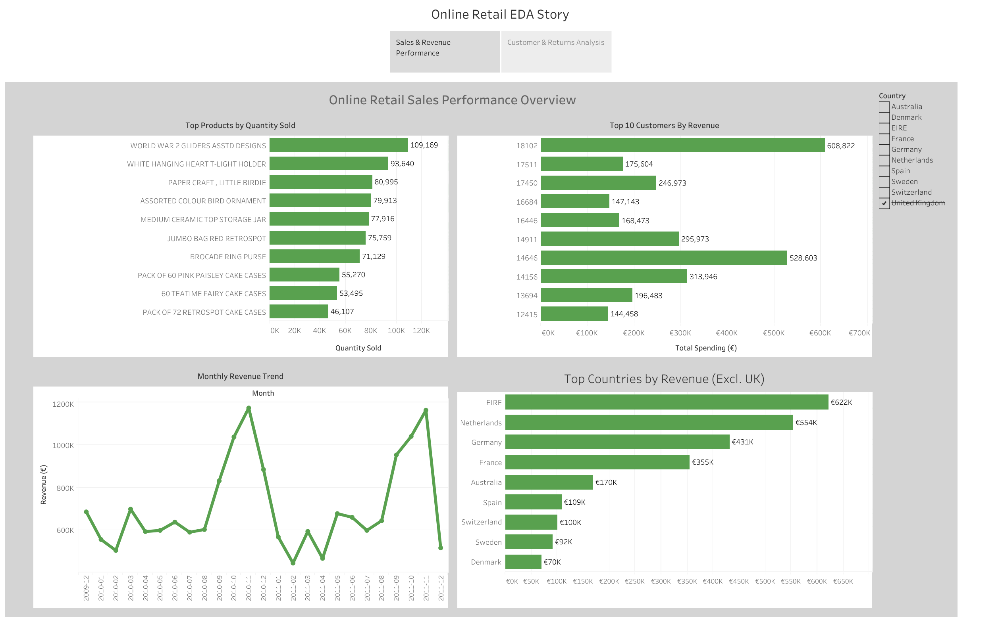
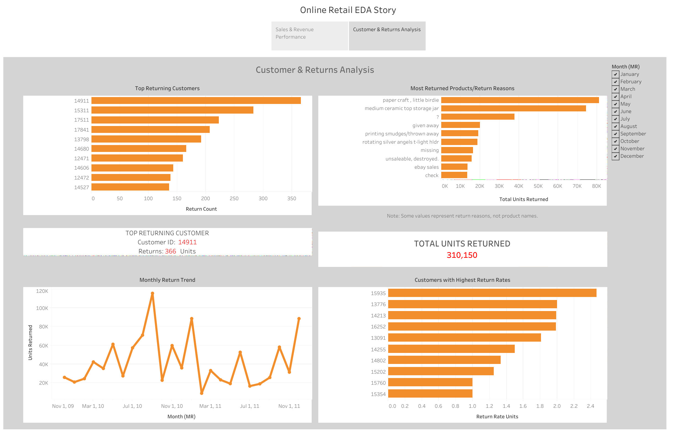

# 🛍️ EDA-onlineretail

> **Exploratory Data Analysis (EDA)** of the Online Retail II Dataset (2009–2011) using Python, Excel, and Tableau.

---

## 📚 Project Overview

This project presents an end-to-end Exploratory Data Analysis (EDA) workflow performed on the UCI Online Retail II dataset.

The analysis focuses on:

* Revenue trends over time
* Customer purchasing behavior
* Product performance analysis
* Return behavior patterns
* Country-level revenue contribution
* KPI dashboard storytelling using Tableau

The project combines Python-based exploratory analysis with interactive Tableau dashboard development and portfolio-ready business storytelling.

---

## 🛠️ Tools and Technologies

* **Python**

  * Pandas
  * NumPy
  * Matplotlib
  * Seaborn

* **Excel**

  * Data cleaning
  * Tableau export preparation

* **Tableau Public**

  * Interactive dashboards
  * KPI storytelling
  * Dashboard filters
  * Tableau Story navigation

* **Jupyter Notebook**

  * Exploratory analysis
  * Data preparation
  * Visualization workflows

---

## 📊 Tableau Story Dashboard

This project includes an interactive Tableau Story with two business-focused dashboards:

1. **Sales & Revenue Performance**
2. **Customer & Returns Analysis**

The Tableau Story contains:

* KPI-focused visual storytelling
* Revenue trend analysis
* Customer behavior insights
* Return pattern analysis
* Country-level revenue exploration
* Interactive dashboard filters

---

## 📈 Dashboard Preview

### 📌 Sales & Revenue Performance



#### Highlights

* Top-selling products by quantity sold
* Top customers by total spending
* Monthly revenue trend analysis
* Revenue contribution by country
* Country filter interaction

---

### 📌 Customer & Returns Analysis



#### Highlights

* Top returning customers
* Most returned products and operational return reasons
* Monthly return trend analysis
* Customer return-rate comparison
* Monthly filter interaction

---

## 🔥 Key Insights

* 🇬🇧 **The United Kingdom dominated revenue**, generating more than €14.7M in sales.
* 🎯 **Revenue was highly concentrated among top customers**, with Customer ID 18102 generating more than €608K.
* 📦 **Return volume and return rate revealed different customer-risk patterns**, requiring both absolute and proportional return analysis.
* 🧾 **Several return records represented operational return reasons instead of product names**, including labels such as:

  * "missing"
  * "check"
  * "unsaleable, destroyed"

---

## 📊 Interactive Tableau Dashboard

👉 **View Tableau Story on Tableau Public:**
https://public.tableau.com/app/profile/artur.melnyk/viz/EDAvisualization/OnlineRetailEDAStory

---

## 🧪 Project Deliverables

| Deliverable                                          | Description                                      |
| :--------------------------------------------------- | :----------------------------------------------- |
| `notebooks/online_retail_eda.ipynb`                  | Full Jupyter Notebook with exploratory analysis  |
| `data/For_Tableau_online_retail_II.xlsx`             | Cleaned Tableau-ready dataset                    |
| `dashboards/online_retail_eda_story.twbx`            | Tableau workbook containing dashboards and story |
| `docs/Online_Retail_EDA_Technical_Documentation.pdf` | Technical documentation                          |
| `docs/Online_Retail_EDA_Presentation.pdf`            | Portfolio presentation PDF                       |
| `docs/Online_Retail_EDA_Presentation.pptx`           | Editable presentation source                     |
| `docs/tableau_exports/tableau_story_export.pdf`      | Exported Tableau Story PDF                       |
| `images/`                                            | Dashboard preview images                         |

---

## 📂 Repository Structure

```text
EDA-onlineretail/
├── dashboards/
│   └── online_retail_eda_story.twbx
├── data/
│   └── For_Tableau_online_retail_II.xlsx
├── docs/
│   ├── Online_Retail_EDA_Technical_Documentation.pdf
│   ├── Online_Retail_EDA_Presentation.pdf
│   ├── Online_Retail_EDA_Presentation.pptx
│   └── tableau_exports/
│       └── tableau_story_export.pdf
├── images/
│   ├── Sales_&_Revenue_Performance.png
│   └── Customer_&_Returns_Analysis.png
│   
├── notebooks/
│   └── online_retail_eda.ipynb
├── .gitignore
├── LICENSE
├── README.md
└── requirements.txt
```

---

## 🚀 How to Reproduce

### 1. Clone the repository

```bash
git clone https://github.com/ArturMelnyk-analyst/EDA-onlineretail.git
cd EDA-onlineretail
```

---

### 2. Install required Python libraries

```bash
pip install -r requirements.txt
```

---

### 3. Launch Jupyter Notebook

```bash
jupyter notebook
```

---

### 4. Run the notebook

Open and execute:

```text
notebooks/online_retail_eda.ipynb
```

---

### 5. Open Tableau workbook

Open:

```text
dashboards/EDA_visualization.twbx
```

---

## 📚 Documentation

* Technical Documentation
  `docs/Online_Retail_EDA_Technical_Documentation.pdf`

* Portfolio Presentation PDF
  `docs/Online_Retail_EDA_Presentation.pdf`

* Editable Presentation PPTX
  `docs/Online_Retail_EDA_Presentation.pptx`

* Tableau Story Export PDF
  `docs/tableau_exports/tableau_story_export.pdf`

---

## 📜 License

Distributed under the MIT License.

See `LICENSE` for more information.

---

## 🙌 Contact

Created by **Artur Melnyk**

Feel free to connect for:

* collaboration
* feedback
* analytics opportunities
* dashboard discussions
* data visualization projects
